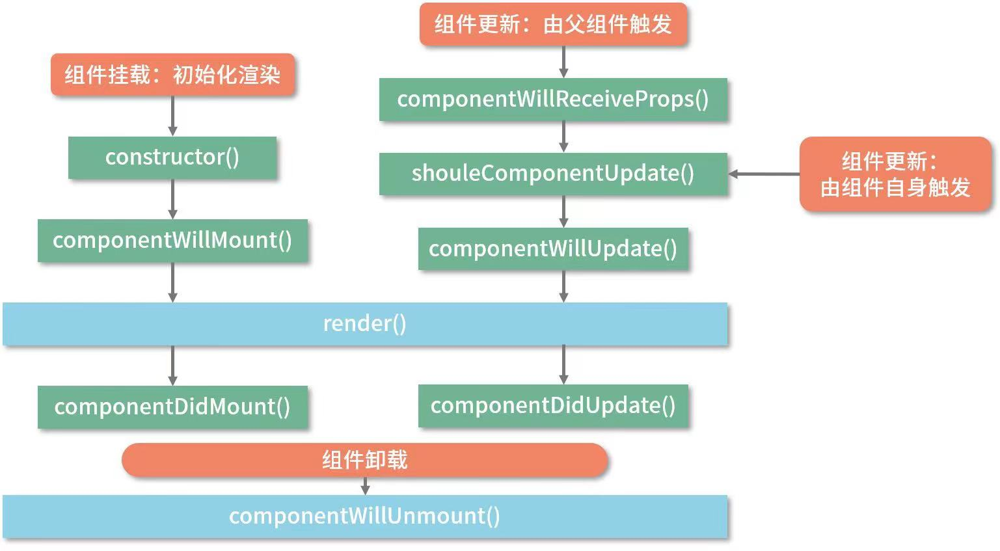
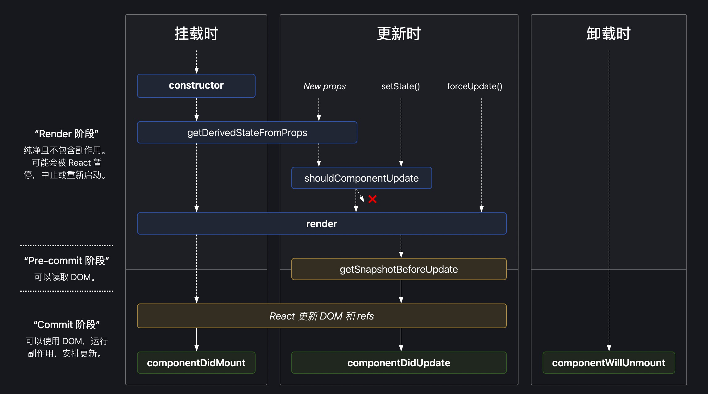
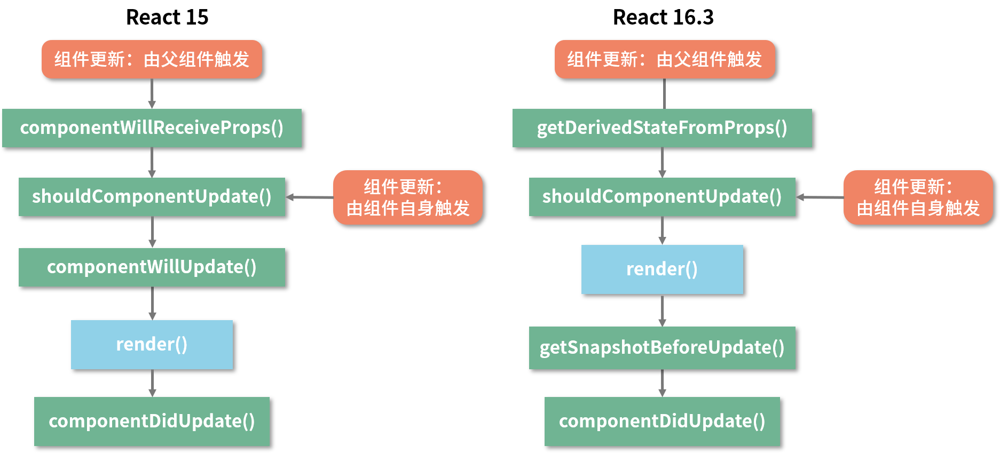
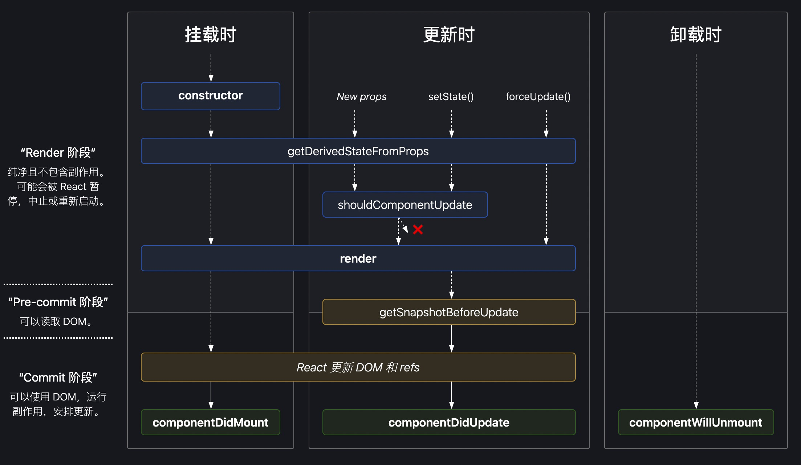

## 为什么React16要更改组件的生命周期？

### 虚拟DOM：核心算法的基石

* 组件在初始化时，会通过调用生命周期中的render方法，生成虚拟DOM，然后再通过调用ReactDOM.render方法，实现虚拟DOM到真实DOM的转换。
* 当组件更新时，会再次通过调用render方法生成新的虚拟DOM，然后借助diff定位出两次虚拟DOM的差异，从而针对发生变化的真实DOM作定向更新

### React生命周期：React15

```tex
1. constructor()
2. componentWillReceiveProps();
3. shouldComponentUpdate();
4. componentWillMount();
5. componentWillUpdate();
6. componentDidUpdate();
7. componentDidMount();
8. render();
9. componentWillUnmount()
```



```react
import React from 'react';
import ReactDOM from 'react-dom';

// 定义子组件
class LifeCycle extends React.Component {
  constructor(props) {
    console.log("进入 constructor")
    super(props)
    this.state = {
      text: "子组件文本"
    }
  }
  
  // 初始化渲染时调用
  componentWillMount() {
    console.log("componentWillMount执行")
  }
  
  // 挂载完时调用
  componentDidMount() {
    console.log("componentDidMount执行")
  }
  
  // 父组件修改组件的props时会调用
  componentWillReceiveProps(nextProps) {
    console.log("componentWillReceiveProps执行")
  }
  
  // 组件更新时调用
  shouldComponentUpdate(nextProps, nextState){
    console.log("shouldComponentUpdate执行")
  }
  
  // 组件将更新时调用
  componentWillUpdate(nextProps, nextState) {
    console.log("componentWillUpdate执行")
  }
  
  // 组件更新后调用
  componentDidUpdate(preProps, preState) {
    console.log("componentDidUpdate执行")
  }
  
  // 组件卸载时调用
  componentWillUnmount() {
    console.log("子组件的componentWillUnmount执行")
  }
  
  changeText = () => {
    this.setState({
      text: '修改后的子组件文本'
    })
  }
  
  render() {
    console.log("render方法执行")
    return (
    	<div className="container">
        <button onClick={this.changeText}>修改子组件文本</button>
        <p className="textContent">{ this.state.text }</p>
        <p className="fatherContent">{ this.props.text }</p>
      </div>
    )
  }
}

// 定义父组件
class LifeCycleContainer extends React.Component {
  state = {
    text: "父组件文本",
    ownerText: '父组件自身文本'
    hideChild: false
  };
	
	changeText = () => {
    this.setState({
      text: "修改后的父组件文本"
    })
  }
  
  changeOwnerText = () => {
    this.setState({
      ownerText: '修改父组件自身文本'
    })
  }
  
  hideChild = () => {
    this.setState({
      hideChild: true
    })
  }
  
  render() {
    return (
      <div className="fatherContainer">
        <button onClick={this.changeText}>修改父组件文本</button>
        <button onClick={this.changeOwnerText}>修改父组件自身文本</button>
        <button onClick={this.hideChild}>隐藏子组件</button>
        { this.state.hideChild? null: <LifeCycle text={this.state.text} /> }
      </div>
    )
  }
}

ReactDOM.render(<LifeCycleContainer />, document.getElementById("root"));
```


### Mounting 阶段：组件的初始化渲染（挂载）

挂载过程仅会发生一次，在此过程中，组件被初始化，然后会被渲染到真实DOM里，完成“首次渲染”

在这一流程中以上代码执行结果为：

```js
进入constructor
componentWillMount执行
render方法执行
componentDidMount执行
```

### Updating阶段：组件更新

* 一种由父组件更新触发的更新
* 组件自身调用自己的setState触发的更新

生命周期流程见上图life_cicle_15

**componenWillReceiProps(nextProps) 到底是由什么触发的？**

在这个生命周期方法里，nextProps表示的是接收到新props内容，而现有的props（相对于nextProps的“旧props”）我们可以通过this.props拿到，以此得到props的变化

**componenWillReceiProps并不是由props的变化触发的，而是由父组件的更新触发的**

**componenWillReceiProps仅在组件的props内容发生变化时触发对吗？**

点击“修改父组件文本内容”按钮，父组件的state.text会发生改变，进而带动子组件的props.text发生改变。此时一定会触发componenWillReceiProps这个生命周期。

> 请注意，如果父组件导致组件重新渲染，即使 props 没有更改，也会调用此方法。如果只想处理更改，请确保进行当前值与变更值的比较。 --react中文官网

**子组件自身setState触发更新**

```js
//shouldComponentUpdate执行
//componentWillUpdate执行
//render方法执行
//componentDidUpdate
```

**componentWillUpdate**在render方法前触发，允许在其中做一些不涉及DOM操作的工作，类似挂在阶段的**componnetWillMount**。**componentDidUpdate**在render方法后执行，和**componentDidMount**类似用来处理DOM操作。除此之外，componentDidUpdate的执行也通常代表着子组件更新完毕 可以通知父组件。

**render与性能：shouldComponentUpdate(nextProps, nextState)**

render方法中带着对虚拟DOM的构建和对比，过程相当耗时。为了避免不必要的render开销，react提供了shouldComponentUpdate方法。

react根据shouldComponentUpdate方法的返回值（默认为true，更新）来决定是否执行该方法之后的生命周期，进而决定是否对组件进行re-render操作。

### Unmounting阶段

仅涉及componentWillUnmount()生命钩子

如何触发：

1. 组件在父组件中被移除了：对应上文中的hideChild

2. 组件中设置了key属性，父组件在render过程中，发现key值和上一次不一样，那么这个组件就会unmount


### 生命周期：react16.3



```jsx
import React from 'react';
import ReactDom from 'react-dom';

class LifeCycle extends React.Components {
  constructor(props) {
    console.log("进入constructor")
    super(props)
    this.state = { text: '子组件的文本' }
  }
  
  // 初始化/更新时调用
  static getDerivedStateFromProps(props, state) {
    console.log("getDerivedStateFromProps 执行", props, state);
    
    // state = { text: '子组件的文本', fatherText: '父组件文本' }
    return {
      fatherText: props.text
    }
  }
  // 初始化渲染时调用
  componenDidMount() {
    console.log("componentDidMount 执行")
  }
  // 组件更新时调用
  shouldComponentUpdate(prevProps, nextState) {
    console.log("shouldComponentUpdate 执行");
    return true
  }
  // 组件更新时调用
  getSnapshotBeforeUpdate(prevProps, nextState) {
    console.log("getSnapshotBeforeUpdate" 执行)
    return 'snap'
  }
 	// 组件更新后调用
  componenDidUpdate(prevProps, preState, valueFromSnapShot) {
    console.log("componentDidUpdate执行", valueFromSnapShot)
  }
  // 组件卸载时调用
  componentWillUnmount() {
    console.log("componentWillUnmount 执行")
  }
  
  changeText = () => {
    this.setState({
      text: '修改后的文本'
    })
  }
  
  render() {
    console.log("render执行")
    return (
      <div>
        <button onClick={this.changeText}>修改子组件文本</button>
        <p>{ this.state.text }</p>
        <p>{ this.props.text }</p>
      </div>
    )
  }
  
}

class LifeCycleContainer extends React.Component {
  state = {
    text: '父组件文本',
    hideChild: false
  }

	changeText = () => {
    this.setState({
      text: '修改父组件文本'
    })
  }
  
  hideChild = () => {
    this.setState({
      hideChild: true
    })
  }
  
  render() {
    console.log("父组件render执行")
    return (
      <div>
        <button onClick={ this.changeText }>修改父组件文本</button>
        <button onClick={ this.hideChild }>隐藏子组件</button>
        { hideChild ? null : <LifeCycle text={this.state.text} /> }
      </div>
    )
  }
}

ReactDOM.render(<LifeCycleContainer />, document.getElementById("root"))
```

### Mounting阶段： constructor => getDerivedStateFromProps => render => componentDidMount

```js
// 进入constructor
// getDerivedStateFromProps 执行
// render 执行
// componenDidMount 执行
```

和15版本相比，废弃了componentWillMount，新增了getDerivedStateFromProps（从props来派生/更新state）

### static getDerivedStateFromProps(props, state)

> 与 componentDidUpdate 一起，这个新的生命周期涵盖过时componentWillReceiveProps 的所有用例。 --react中文网

1. 此方法为不依赖实例的静态方法，因此是无法访问this的
2. 接收两个参数：props和state，分别代表当前组件接收到的来自父组件的props和当前组件的state
3. 需要一个对象格式的返回值，因为react需要用这个值来派生/更新组件的state，且对state的更新并非“覆盖”更新，而是针对某个属性定向更新。所以当你确实不存在“使用props派生state”的情况时，最好别写 或者return null

### Updating阶段：





在16.4中，任何因素触发的更新都会触发getDerivedStateFromProps，而16.3中只有父组件更新触发

### getSnapShotBeforeUpdate

与getDerivedStateFromProps类似，都必须返回一个值。区别在于它的返回值会作为componentDidUpdate的第三个参数。它的执行时机是在render方法之后，真实DOM更新之前。在这个阶段，我们可以**同时获取到更新前的真实DOM和更新前后的state&props信息**

这个生命周期的设计是为了

> 与 componentDidUpdate 一起，涵盖过时的 componentWillUpdate 的所有用例 --react中文官网

### React16两次更新

Fiber架构

Fiber会使原本同步的渲染过程变成异步。

在 React 16 之前，每当我们触发一次组件的更新，React 都会构建一棵新的虚拟 DOM 树，通过与上一次的虚拟 DOM 树进行 diff，实现对 DOM 的定向更新。这个过程，是一个递归的过程。同步渲染的递归调用栈非常深，只有最底层的调用返回了，整个渲染过程才会开始逐层返回。这个过程漫长且不可打断，整个过程中，浏览器没有办法处理任何渲染之外的事，会进入无法与用户交互的状态。因此渲染时间长一点就会造成卡顿甚至卡死

引入Fiber架构，恰好解决这个风险：Fiber会将一个大的更新任务拆解为许多小任务。每当执行完一个小任务时，渲染线程都会把主线程交回去，看看有没有优先级更高的工作要处理，确保其它任务不会被“饿死”的情况，进而避免同步渲染带来的卡顿。在这个过程中，渲染线程是可以被打断的，这就是所谓的“异步渲染”

Fiber 架构的重要特征就是可以被打断的异步渲染模式。但这个“打断”是有原则的，根据“能否被打断”这一标准，React 16 的生命周期被划分为了 render 和 commit 两个阶段，而 commit 阶段又被细分为了 pre-commit 和 commit。具体生命周期如上图[life_cycle_>=16.4]

**总的来说，render阶段（对用户不可见）在执行过程中允许被打断，而commit阶段则总是同步执行的**

### 生命周期“废旧立新”背后的思考

在 Fiber 机制下，**render 阶段是允许暂停、终止和重启的**。当一个任务执行到一半被打断后，下一次渲染线程抢回主动权时，这个任务被重启的形式是“重复执行一遍整个任务”而非“接着上次执行到的那行代码往下走”。**导致 render 阶段的生命周期都是有可能被重复执行的**。

废弃的生命周期：

* componentWillMount
* componentWillUpdate
* componentWillRecieveProps

这些生命周期的共性就是都处于render阶段，都可能被重复执行

比较有风险的操作（包括但不限于）

* setState()
* fetch发起异步请求
* 操作真实DOM

这些操作存在的问题（包括但不限于）

* **完全可以转移到其它生命周期（尤其是componentDidxxx）去做**

  比如在 componentWillMount 里发起异步请求，以为这样做就可以让异步请求回来得“早一点”，从而避免首次渲染白屏。

  可惜你忘了，异步请求再怎么快也快不过（React 15 下）同步的生命周期。componentWillMount 结束后，render 会迅速地被触发，所以说首次渲染依然会在数据返回之前执行。这样做不仅没有达到你预想的目的，还会导致服务端渲染场景下的冗余请求等额外问题，得不偿失。

* **在 Fiber 带来的异步渲染机制下，可能会导致非常严重的 Bug。**

  试想，假如你在 componentWillxxx 里发起了一个付款请求。由于 render 阶段里的生命周期都可以重复执行，在 componentWillxxx 被打断 + 重启多次后，就会发出多个付款请求。

  比如说，这件商品单价只要 10 块钱，用户也只点击了一次付款。但实际却可能因为 componentWillxxx 被打断 + 重启多次而多次调用付款接口，最终付了 50 块钱；又或者你可能会习惯在 componentWillReceiveProps 里操作 DOM（比如说删除符合某个特征的元素），那么 componentWillReceiveProps 若是执行了两次，你可能就会一口气删掉两个符合该特征的元素。

* **即使你没有开启异步，React 15 下也有不少人能把自己“玩死”。**

  比如在 componentWillReceiveProps  和 componentWillUpdate 里滥用 setState 导致重复渲染死循环的，大家都懂哈（邪魅一笑）。

总的来说，React 16 改造生命周期的主要动机是为了配合 Fiber 架构带来的异步渲染机制。在这个改造的过程中，React 团队精益求精，针对生命周期中长期被滥用的部分推行了具有强制性的最佳实践。这一系列的工作做下来，首先是确保了 Fiber 机制下数据和视图的安全性，同时也确保了生命周期方法的行为更加纯粹、可控、可预测。
